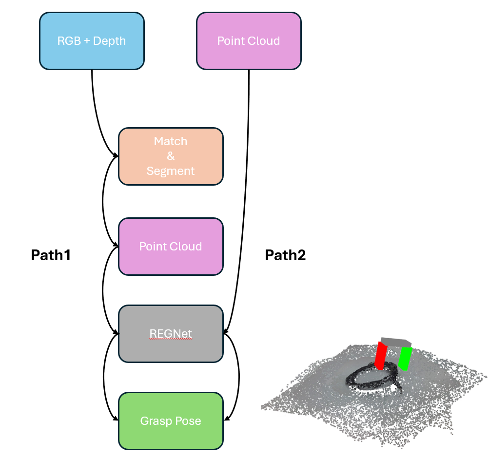

# General Grasp Generation

This is the integration version combined https://github.com/haha20331/Match-Anything and https://github.com/haha20331/REGNetv2
Using SAM6D as the object recognition and segmentation modules for cropping the ROI point-cloud, REGDv2 as the grasping generation module given the point-cloud.
The workflow supports giving the rgb+depth images as input to generating the grasping pose, using only point-cloud as input is supported as well.




## Environment

- Ubuntu 22.04
- Python 3.11.12


## Dependencies

Check ```requirements.txt``` and ```install.sh``` to see detail dependencies.


## Installation

Run ./install.sh to setup environment.

I have tested on both virtualenv and miniforge, either way could be choosed to isolate the environment.

This repo runs on PyTorch 2.4.1 and CUDA 12.4. If you would like to change PyTorch or CUDA version, please be caution that the following package are have a far-reaching effect to the version of other packages:
- ultralytics
- xformers
- numpy (Do not upgrade to NumPy 2)


## Quick-Start

We offer some scripts for quickly see the effect of the methods.
For users whose GPU VRAM>=8GB, it is recommanded to run under efficient way.

### Run RegNetV2 as a model service

This program loads RegNetV2 from checkpoints and runs it as a model service. Once the program receives a request, it reads scene pointcloud from file, generate grasping poses from pointcloud and finally response the best grasping pose to the client.

```
python3 run_flask_server.py
```

### RGB+Depth frame as input

```
python3 run_efficiency_workflow_rgbd.py
```

### Point-cloud as input

```
python3 run_efficiency_workflow_pcd.py
```

### RGB+Depth frame as input

For users whose GPU VRAM<8GB:
```
python3 run_memory_workflow_rgbd.py
```

### Point-cloud as input

For users whose GPU VRAM<8GB:
```
python3 run_memory_workflow_pcd.py
```


## Configuration

We mainly have three config files, `MA_config.yaml`, `config.yaml` and `workflow.yaml`. 
`MA_config.yaml` is for Macthing+Segment.
`config.yaml` is for grasp pose generation, including some camera settings, i.e., extrinsic parameters.
`workflow.yaml` is for workflow settings, you will see there are some duplicate parameters which appear in the above two files, Note that only `method` and `fx`, `fy`, `cx` and `cy` will affect.

In the future, we can make it all in one.


## TODO

- mechanism for mult-target matching.
- collision-free grasping filter
- mask all configs in one.


## Information

- Author: Yu-Hsien Mike Chen
- Latest update: 2025/6/11
